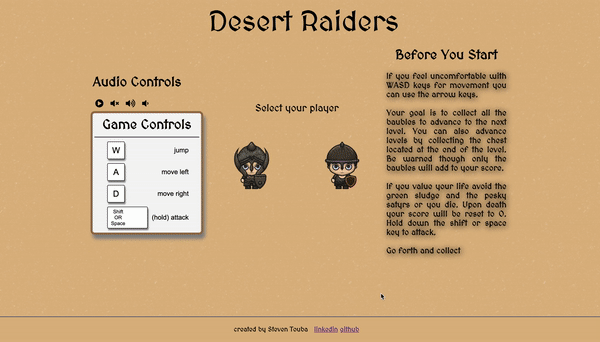

# Desert Raiders

[Live Link](https://steventouba.github.io/desert_raiders/)

## Background
Desert Raiders is a classical 2-D platformer inspired by games such as Super Mario Bros and Prince of Persia. 

In a throwback to the 80's, you control one of two heroes as you run, jump and slice your way through the game. The goal, collect as much treasure as you can. 

## Technologies
This project was implemented with the following technologies:

JavaScript for game logic  
Canvas for effects and animations

## Game Logic and Functionality 

**Movement** 
  Users can move and attack using an combination of the following keys: "W", "A", "D", "LeftArrow", "RightArrow", "UpArrow", "SHIFT", "SPACE".   
  
  
  The following function is used to track key presses and respond to user input. 
  ```javascript 
  const keys = trackKeys(["a", "d", "w",
  "ArrowLeft", "ArrowRight", "ArrowUp",
  "Shift", " "]);

function trackKeys(keys) {
  let down = Object.create(null);
  function track(event) {
    if (event.key === "w" || event.key === "ArrowUp") { 
      document.getElementById("jump").play(); 
    } else if (event.key === "Shift" || event.key === " ") { 
      document.getElementById("attack").play();
    }
    
    if (keys.includes(event.key)) {
      event.preventDefault();
      down[event.key] = event.type === "keydown";
    }
  }
  window.addEventListener("keydown", track);
  window.addEventListener("keyup", track);

  return down;
}
```
